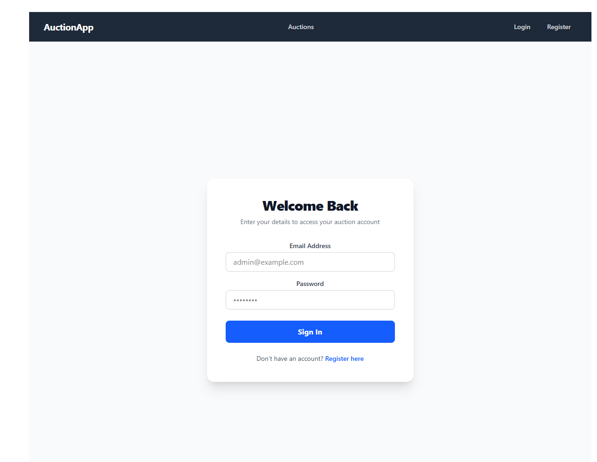

# 🎨 AuctionHub Frontend


AuctionHub Frontend is a high‑performance **React + TypeScript** single‑page application (SPA) for a modern online auction experience.  
It provides a seamless UI for browsing auctions, placing bids, managing your own listings, and performing admin operations.

---

## 🖼️ Project Preview


### User Authentication

<p align="center">
  
</p>

### Main Dashboard

<p align="center">
  
</p>

---

## 🛠️ Tech Stack

- **Framework:** React 18 (functional components & hooks)  
- **Language:** TypeScript (strict typing)  
- **Build Tool:** Vite (fast dev server & bundling)  
- **State Management:** Context API (`AuthContext` / `AuthProvider`)  
- **Styling:** Tailwind CSS (mobile‑first responsive design)  
- **Networking:** Axios with JWT interceptor  

---

## 📂 Project Structure

```text
src/
  api/
    axiosInstance.ts        # Axios instance with baseURL & JWT interceptor

  assets/
    ...                     # Static assets (e.g. logos)

  components/
    auction/
      Navbar.tsx
      RequireAdmin.tsx
      UpdatePasswordForm.tsx

  contexts/
    AuthContext.tsx
    AuthProvider.tsx
    useAuth.ts

  pages/
    AdminDashboard.tsx
    AuctionCreate.tsx
    AuctionDetail.tsx
    AuctionEdit.tsx
    AuctionList.tsx
    Login.tsx
    MyAuctions.tsx
    Register.tsx
    UpdatePassword.tsx

  services/
    auctionService.ts       # Auction-related API calls
    authService.ts          # Login / register
    userService.ts          # Update password, user info

  types/
    Types.ts                # Shared DTO interfaces (mirrored from backend)

  utils/
    errorUtils.ts           # getErrorMessage for Axios errors
    TokenHandler.ts         # Read/write JWT token from storage

  App.css
  App.tsx                   # Main routing and layout


✨ Key Features
👤 User Experience
Registration followed by automatic login using the same credentials.

My Auctions page with clear status badges (Live, Expired, Disabled).

Friendly empty state when you have no auctions yet:
“You haven't created any auctions yet.”

In‑app password update with current‑password verification via UpdatePasswordForm.

⚖️ Bidding System
Server‑side validation for all bids (must be higher than starting price / current highest bid, auction must be open, user cannot bid on own auction).

AuctionDetail page shows full auction information, current highest bid, and bid history.

Clear error feedback if a bid is too low, the auction is closed, or the user tries to bid on their own auction (messages come from backend and are displayed via getErrorMessage).

🛡️ Administrative Control
Admin Dashboard (AdminDashboard.tsx) for admin‑only operations (e.g. viewing and disabling auctions).

Route protection using <RequireAdmin> (and optionally <RequireAuth>):

Only authenticated users can access protected pages.

Only users with role === "Admin" can access admin routes.

📱 Responsive Design
Desktop: multi‑column grids for auction cards and admin overviews.

Mobile: single‑column layout with stacked sections for comfortable reading and interaction.

Navbar designed to adapt to different screen sizes (you can extend it with a hamburger menu if needed).

🔐 Authentication Flow
On login, authService.login sends credentials to the backend and receives { token, user }.

AuthProvider calls login(token, user) to:

store them in React state and localStorage,

update isAuthenticated.

axiosInstance reads the token (via TokenHandler.ts) and attaches
Authorization: Bearer <token> to all outgoing API requests.

On register, the app:

Calls authService.register.

Uses the same email/password to call the login API.

Calls AuthContext.login(...).

Redirects to /my-auctions.

🧩 Services & Utilities
axiosInstance
Centralized Axios configuration:

ts
const axiosInstance = axios.create({
  baseURL: import.meta.env.VITE_API_BASE_URL ?? "https://localhost:5001/api",
});

axiosInstance.interceptors.request.use(config => {
  const token = getToken();
  if (token) {
    config.headers = config.headers ?? {};
    config.headers.Authorization = `Bearer ${token}`;
  }
  return config;
});
auctionService
Encapsulates all auction‑related API calls, for example:

getAuctions() – list auctions

getAuctionById(id) – fetch auction detail

createAuction(dto) – create a new auction

updateAuction(id, dto) – edit auction

getMyAuctions() – current user’s auctions

placeBid(auctionId, amount) – place a bid

authService
login(loginDto) – returns { token, user }

register(registerDto) – registers a new user (then frontend auto‑logs in)

userService
updatePassword(dto) – calls backend PATCH /users/update to change the logged‑in user’s password.

errorUtils
getErrorMessage(err, defaultMessage) extracts a readable message from Axios errors:

Supports plain string responses and { message: string } shapes.

Falls back to defaultMessage when nothing useful is available.

Pages like AuctionDetail, MyAuctions, and UpdatePassword use it in catch blocks to show consistent error messages.

🚀 Getting Started
1️⃣ Install Dependencies
bash
npm install

2️⃣ Configure Environment
Create a .env file in the project root:

bash
VITE_API_BASE_URL=https://localhost:5001/api
Make sure the backend is running and the URL matches this value.

3️⃣ Run Development Server
bash
npm run dev

The app will typically run at:

http://localhost:5173

🔗 Related Backend Project
This frontend consumes the AuctionHub backend API built with ASP.NET Core.

Backend repository (example):
https://github.com/Qian1507/AuctionHub_backend


🌟 Design Highlights
Clear separation of concerns

API calls live in services/ and api/axiosInstance.ts.

Authentication logic is centralized in AuthContext / AuthProvider and accessed via useAuth().

Typed end‑to‑end with DTOs

Shared TypeScript interfaces in types/Types.ts match backend DTOs, reducing bugs caused by mismatched shapes.

Reusable forms & UI

Auction creation and editing share common logic and layout.

UpdatePasswordForm encapsulates the password change workflow and can be reused on different pages.

Robust loading / error / empty states

Pages like MyAuctions clearly distinguish between loading, error, and “no data” states, giving users immediate feedback.

Unified error handling

getErrorMessage converts Axios errors into user‑friendly strings, so all pages display consistent messages.

JWT‑aware routing

Auth‑only and admin‑only routes are enforced using RequireAuth / RequireAdmin, reading state from AuthContext.

📄 License
MIT License

Developed with ❤️ by Qian Li
